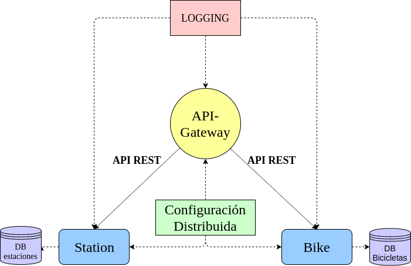

# Arquitectura del proyecto.

Se elige esta arquitectura debido al carácter del problema donde la lógica de negocio se encuentra bien separada debido a esto podemos diferenciar dos entidades que pueden trabajar independientemente la una de las otra. Estas entidades surgen del [análisis](https://github.com/FernandoRoldan93/CC-Project/blob/master/doc/DDD_analisis.md) basado en el diseño guiado por el dominio (DDD, [Domain-Driven Design](https://en.wikipedia.org/wiki/Domain-driven_design)).

Además de esto, esta arquitectura nos aportara una serie de ventajas con respecto a la arquitectura monolítica, como puede ser, entre otras, que los cambios en los distintos microservicios no afectan al resto, pudiendo hacer actualizaciones en dichos microservicios de forma más sencilla.

## Microservicios
Para definir los diferentes microservicios podemos fijarnos en el análisis mencionado anteriormente. Los diferentes microservicios que obtenemos de este análisis son:

* `Bike`: Este microservicio será el encargado de implementar todas las funciones relacionadas con la entidad "bicicleta".

* `Station`: Este microservicio será el encargado de gestionar la entrada y salida de bicicletas en la estación. Además de esto también se encargará de informar del número de puestos libres y bicicletas disponibles en una estación especifica.

## Servicios
Además de los microservicios anteriormente mencionados se incluirán varios servicios que serán de utilidad para gestionar el sistema.

* Primero habrá que incluir un servicio que nos permita realizar todo el logging del sistema de forma centralizada, esto nos permitirá conocer los errores que pueden haber ocurrido en nuestro sistema a la vez que recogemos datos de actividad. Para ello utilizaremos el [módulo](https://realpython.com/python-logging/#the-logging-module) de logging que nos proporciona Python. Utilizaremos este modulo debido a que ya está integrado en el propio lenguaje.

* Por otro lado necesitaremos un sistema de configuración distribuido para poder llevar un control centralizado del estado de cada uno de los microservicios a la vez que realizamos las configuraciones necesarias. Para ello utilizaremos [etcd](https://etcd.io/)

* También necesitaremos una API Gateway para la comunicación entre los diferentes microservicios. Para ello utilizaremos [Kong](https://konghq.com/kong/) por la gran cantidad de facilidades que proporciona y por su fácil mantenimiento. Además de esto ofrece gran variedad de plugins, que nos pueden ser muy útiles.

## Almacén de datos

En este proyecto, necesitaremos almacenar diversa información relacionada con los microservicios que implementaremos.

* Por un lado, en el microservicio `Bike` necesitaremos almacenar información como la "id" de cada una de las bicicletas, año de adquisición, histórico de usuarios, etc..

* Por otro lado, para el microservicio `Estacion` almacenaremos información como la localización, numero de plazas disponibles, numero de plazas totales, etc..

Como se puede ver, la información de ambos microservicios no esta relacionada por lo que no será necesaria una base de datos relacional. Utilizaremos por tanto el almacén de datos [redis](https://redis.io/). Se ha elegido esta base de datos debido a la gran versatilidad que tiene en cuanto a almacenamiento clave-valor se refiere.

## Comunicación entre microservicios

Una vez definidos los elementos del sistema tendremos que crear algún sistema para que se comuniquen entre si, para ello utilizaremos una [RESTful API](https://searchapparchitecture.techtarget.com/definition/RESTful-API). De entre todas las posibles opciones se ha optado por la utilización de [Flask](https://www.palletsprojects.com/p/flask/) y más concretamente de [Flask-RESTful](https://flask-restful.readthedocs.io/en/latest/). Siendo esta ultima una extensión de Flask especialmente dedicada a la creación de RESTful API.

Todo los componentes anteriormente citados, pueden verse reflejados en la siguiente imagen:

